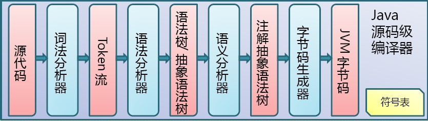
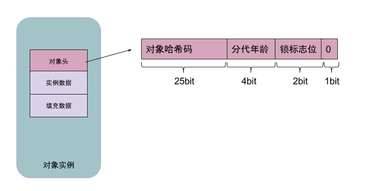

# JVM入门教程
### By Gary

# 1.编译型语言&解释型语言
### 首先，我们编程都是用的高级语言(写汇编和机器语言的大牛们除外)，计算机不能直接理解高级语言，只能理解和运行机器语言，所以必须要把高级语言翻译成机器语言，计算机才能运行高级语言所编写的程序。
## 1.1 编译型语言：
### 用编译型语言写的程序执行之前，需要一个专门的编译过程，通过编译系统（不仅仅只是通过编译器，编译器只是编译系统的一部分）把高级语言翻译成机器语言，把源高级程序编译成为机器语言文件，以后就可以直接运行而不需要编译了，因为翻译只做了一次，运行时不需要翻译，所以编译型语言的程序执行效率高。
## 1.2 解释型语言：
### 解释型语言编写的程序不需要编译。解释型语言在运行的时候才翻译，在执行的时候，专门有一个解释器能够将语言翻译成机器语言，每个语句都是执行的时候才翻译。这样解释型语言每执行一次就要翻译一次，效率比较低。但也不能一概而论，部分解释型语言的解释器通过在运行时动态优化代码，甚至能够使解释型语言的性能超过编译型语言。	
## 1.3 Java语言：
### Java的做法是找到编译型语言和解释性语言的一个中间点：
- Java代码会被编译：被编译成Java字节码，而不是针对某种CPU的二进制代码。
- Java代码会被解释：Java字节码需要被java程序解释执行，此时，Java字节码被翻译成CPU相关的二进制代码。
- JIT编译器的作用：在程序运行期间，将Java字节码编译成平台相关的二进制代码。正因为此编译行为发生在程序运行期间，所以该编译器被称为Just-In-Time编译器。

## 1.3.1 Java代码编译和执行的整个过程
### Java代码编译是由Java源码编译器来完成：

### Java字节码的执行是由JVM执行引擎来完成：

# 2.class字节码文件
### 计算机只能识别0和1，所以编写的程序都需要经过编译器，转换为由0和1组成的二进制本地机器码(Native Code)，class字节码文件也是0，1二进制程序。

## 2.1 class字节码文件结构：
### 一个class字节码文件是由一个ClassFile结构组成：

### 2.1.1 魔数
### 每个Class文件头4个字节称为魔数(Magic Number),作用是用于确定这个Class文件是否能被虚拟机所接受，魔数固定值0xCAFEBABE。这是身份识别，比如jpeg等图片文件头也会有魔数。
### 2.1.2 版本号
### 紧跟魔数，也占用4个字节。从第5字节到第8字节存储的分别是次版本号，主版本号。
### 2.1.3 常量池

# 3.JDK
### JDK(Java Development Kit)是Java语言的软件开发工具包（SDK）。JDK物理存在，是programming tools、JRE和JVM 的一个集合

# 4.JRE
### JRE（Java Runtime Environment）Java运行时环境，JRE物理存在，主要由Java API和JVM组成，提供了用于执行java应用程序最低要求的环境

# 5.JVM
### Java运行时内存数据区被分为5个区域、两种类型。
### 5个数据区：方法区、堆区、虚拟机栈、本地方法栈、程序计数器

### 两种类型:
- 线程共享数据区：
	>1.方法区: 存储已被虚拟机加载的类信息、常量、静态变量、即时编译后代码等数据。常量池位于方法区，并使用永久代来实现方法区的GC
	
	>2.堆区: 用于存放对象实例和数组

- 线程私有数据区：
	>1.虚拟机栈: 方法执行时创建一个栈帧，用于存储局部变量、操作数栈、方法返回地址、动态连接、额外附加信息

	>2.本地方法栈: 用于存放执行Native方法运行数据

	>3.程序计数器: 当前线程所执行字节码指示器，改变计数器指向选取下一条字节码指令

## 5.1 JVM运行流程：
### 类加载器将class文件加载到方法区，如果是java程序，jvm会把main所在的类实例化并在虚拟机栈下开辟栈空间。如果是tomcat等应用服务器，应用服务器会加载。在main之后，栈中就会添加栈帧，然后main可能会new调用方法等等，new就在heap中分配空间，在栈帧的局部变量表中添加引用地址，调用方法会新创一个栈帧。实际上，栈就是一个递归的过程，直到main执行完毕，最后程序结束。

## 5.2 虚拟机栈：
### 虚拟机栈线程私有，生命周期与线程生命周期相同。方法开始执行时创建一个栈帧放入虚拟机栈中，用于存储局部变量表、操作数栈、动态连接、方法返回地址、额外附加信息。在一条线程之中，只有目前正在执行的那个方法的栈帧是活动的。这个栈帧就被称为是当前栈帧（Current Frame），这个栈帧对应的方法就被称为是当前方法（Current Method），定义这个方法的类就称作当前类（Current Class）。对局部变量表和操作数栈的各种操作，通常都指的是对当前栈帧的对局部变量表和操作数栈进行的操作。方法执行完毕栈帧出栈并销毁，虚拟机继续执行虚拟机栈顶的栈帧，前一个栈帧就重新成为当前栈帧了。
### 5.2.1 栈帧(Stack Frame)结构
### 栈帧是用于支持虚拟机进行方法执行的数据结构，栈帧包括：
1. **局部变量表**：局部变量表是一组变量值存储空间，用于存放方法参数和方法内部定义的局部变量。在Java程序编译为Class文件时，就在方法表的Code属性的max_locals数据项中确定了该方法需要分配的最大局部变量表的容量。类变量有两次赋初始值的过程，一次在准备阶段，赋予系统初始值；另外一次在初始化阶段，赋予程序员定义的值。因此即使在初始化阶段程序员没有为类变量赋值也没有关系，类变量仍然具有一个确定的初始值。但局部变量就不一样了，如果一个局部变量定义了但没有赋初始值是不能使用的。
2. **操作数栈（执行方法代码的重要途径）**：操作数栈的最大深度也是编译的时候被写入到方法表的Code属性的max_stacks数据项中。当一个方法刚刚执行的时候，这个方法的操作数栈是空的，在方法执行的过程中，会有各种字节码指向操作数栈中写入和提取值，也就是入栈与出栈操作。例如，在做算术运算的时候就是通过操作数栈来进行的，又或者调用其它方法的时候是通过操作数栈来行参数传递的。
3. **动态连接**：每个栈帧都包含一个指向运行时常量池中该栈帧所属性方法的引用，持有这个引用是为了支持方法调用过程中的动态连接。在Class文件的常量池中存有大量的符号引用，字节码中的方法调用指令就以常量池中指向方法的符号引用为参数。这些符号引用一部分会在类加载阶段或第一次使用的时候转化为直接引用，这种转化称为静态解析。另外一部分将在每一次的运行期期间转化为直接引用，这部分称为动态连接。
4. **方法返回地址**：当一个方法被执行后，有两种方式退出这个方法。第一种方式是执行引擎遇到任意一个方法返回的字节码指令，是否有返回值和返回值的类型将根据遇到何种方法返回指令来决定，这种退出方法方式称为正常完成出口(Normal Method Invocation Completion)。另外一种退出方式是，在方法执行过程中遇到了异常，并且这个异常没有在方法体内得到处理，无论是Java虚拟机内部产生的异常，还是代码中使用athrow字节码指令产生的异常，只要在本方法的异常表中没有搜索到匹配的异常处理器，就会导致方法退出，这种退出方式称为异常完成出口(Abrupt Method Invocation Completion)。一个方法使用异常完成出口的方式退出，是不会给它的调用都产生任何返回值的。在方法退出之前，都需要返回到方法被调用的位置，程序才能继续执行，方法返回时可能需要在栈帧中保存一些信息，用来帮助恢复它的上层方法的执行状态。方法退出的过程实际上等同于把当前栈帧出栈，因此退出时可能执行的操作有：恢复上层方法的局部变量表和操作数栈，把返回值(如果有的话)压入调用都栈帧的操作数栈中，调用PC计数器的值以指向方法调用指令后面的一条指令等。
5. **额外附加信息**：虚拟机规范允许具体的虚拟机实现增加一些规范里没有描述的信息到栈帧中，例如与高度相关的信息，这部分信息完全取决于具体的虚拟机实现。在实际开发中，一般会把动态连接，方法返回地址与其它附加信息全部归为一类，称为栈帧信息。

## 5.2.2 为什么方法调用使用栈来实现？
### 函数调用的局部状态之所以用栈来记录是因为这些数据的存活时间满足“后入先出”（LIFO）顺序，而栈的基本操作正好就是支持这种顺序的访问。
### 举例说，假如有下面程序：
	int main() {
	  a();
	  return 0;
	}
	
	void a() {
	  b();
	}
	
	void b() {
	  c();
	}
	
	void c() {
	}
### 那么整个程序的函数活动时间可以表示为：
	main()  a()  b()  c()
	   -                         main()
	   |
	   +>     -                    a()
	   .      |
	   .      +>   -                 b()
	   .      .    |
	   .      .    +>   -              c()
	   .      .    .    |
	   .      .    +   <-              return from c()
	   .      .    |
	   .      +   <-                 return from b()
	   .      |
	   +     <-                    return from a()
	   |
	   -                         return from main()
### 可以看到，函数的调用有完美的嵌套关系——调用者的生命周期总是长于被调用者的生命周期，并且后者在前者的之内。这样，被调用者的局部信息所占空间的分配总是后于调用者的（后入），而其释放则总是先于调用者的（先出），所以正好可以满足栈的LIFO顺序，选用栈这种数据结构来实现调用栈是一种很自然的选择。

## 5.3 本地方法栈：

## 5.4 程序计数器：
### 程序计数器可看做当前线程所执行字节码行号的指针，每个线程都有一个独立的程序计数器，各个线程之间计数器互不影响。如果当前线程执行的是Native方法，则计数器为空。执行Java方法时，这个计数器记录执行字节码指令地址。

## 5.5 方法区：
### 方法区（Method Area）是可供各条线程共享的运行时内存区域。为了跟Java堆区分开来，它有一个别名叫做Non-Heap。方法区存储了每一个类的结构信息，例如运行时常量池（Runtime Constant Pool）、字段和方法数据、构造函数和普通方法的字节码内容、还包括一些在类、实例、接口初始化时用到的特殊方法。方法区在虚拟机启动的时候被创建，虽然方法区是堆的逻辑组成部分，但是简单的虚拟机实现可以选择在这个区域不实现垃圾收集。方法区的容量可以是固定大小的，也可以随着程序执行的需求动态扩展，并在不需要过多空间时自动收缩。
### JDK7之前(JDK1.2~JDK6)，方法区以永久代实现，GC被扩展到方法区。由于永久代存储的数据生命周期非常长，GC在这个区域消耗时间长且回收效果差，所以方法区GC频率很低。永久代的大小可以用-XX:PermSize和-XX:MaxPermSize来进行调整。一般默认固定为64M。
### JDK7中开始移除永久代，将字符串常量和类引用移到了堆中。但在JDK7中永久代依然存在，在加载足够多的类信息时也会出现OOM。但是在运行时调用String.intern()增加字符串常量不会使永久代OOM了(JDK7以前是会OOM的)。
### JDK8之后永久代被完全移除，方法区移至Metaspace，字符串常量移至Java Heap。方法区的数据存储在与堆不相连的本地内存区域，称为元空间。元空间最大的问题就是碎片化。元空间默认情况下最大为主机可分配内存大小，但是可以通过-XX:MaxMetaspaceSize来限制其增长。
>### JDK8后永久代为什么被移出HotSpot JVM了？
>### 原因主要有两个：
1. 永久代是有大小限制的，因此如果加载的类太多，很有可能导致永久代内存溢出，由于Permanent Generation内存经常不够用或发生内存泄露，引发恼人的java.lang.OutOfMemoryError: PermGen （在Java Web开发中非常常见）。
2. 移除Permanent Generation可以促进HotSpot JVM与JRockit VM的融合，因为JRockit没有永久代。

### 5.5.1 运行时常量池
### 是方法区的一部分，用于存放编译器生成的各种字面量和符号引用。运行时常量池除了编译期产生的Class文件的常量池，还可以在运行期间，将新的常量加入常量池，比较常见的是String类的intern()方法。
- 字面量：与Java语言层面的常量概念相近，包含文本字符串、声明为final的常量值等
- 符号引用：编译语言层面的概念，包括以下3类：
	>类和接口的全限定名
	
	>字段的名称和描述符
	
	>方法的名称和描述符

## 5.6 元数据区
### 由于PermGen内存管理的效果远没有达到预期，所以JCP已经着手去除PermGen的工作。自JDK7，字符串常量已经从永久代移除。在JDK8中，PermGen被彻底移除，取而代之的是metaspace数据区，原来永久代存放的内容一部分放在了堆，一部分放在了元空间（Metaspace），元空间是JDK 8新增的一块区间。JDK 8开始把类的元数据放到本地堆内存(native heap)中，这一块区域就叫Metaspace。元数据区使用Native内存，申请和释放由虚拟机负责管理。失效参数-XX:PermSize和-XX:MaxPermSize会被忽略并提出警告。Metaspace通过参数-XX:MetaspaceSize和-XX:MaxMetaspaceSize设定。

## 5.7 直接内存
### 直接内存不属于虚拟机运行时内存，该空间划分在虚拟机外，性能比较好，大小不受堆内存容量限制。不过，直接内存会受到物理机剩余可用内存、处理器寻址空间的限制。如果虚拟机堆内存分配太大，可能会导致剩余直接内存空间不足而出现运行时异常。如果你对NIO有所了解，可能会知道 NIO是可以使用Native Methods来使用直接内存区的。NIO是在JDK1.4以后新加入的类，基于通道（Channel）与缓冲区（Buffer）的I/0方式，它可以使用Native函数库直接分配堆外内存，然后通过一个存储在java堆中的DirectByteBuffer对象作为这块内存的引用来进行操作。这样可以显著提高性能，避免java堆与native堆中来回复制数据。直接内存不会受到java堆大小的限制，但是会受到本机总内存的大小和处理器寻址空间的限制。所以也可能出现oom的异常。

## 5.8 堆区：
### 堆区被所有线程共享，是Java虚拟机管理的最大的一块内存，也是GC的主战场，里面存放的是几乎所有的对象实例和数组数据。堆区中内存分配和回收要消耗非常多的处理器资源。相比之下，栈则更容易管理且轻巧，所有内存都在进出栈过程中自然而然地完成申请和释放。JIT编译器有栈上分配、标量替换等优化技术的实现导致部分对象实例数据不存在Java堆，而是栈内存。数据的生命周期随着入栈和出栈而完成管理，不需要像堆内存一样进行繁杂的回收操作，减轻堆内存的压力。
- 从内存分配角度，Java堆可以划分出线程私有的分配缓冲区(Thread Local Allocation Buffer,TLAB)；有利于更高效地划分线程私有的缓冲区，为了更快的分配内存
- 从内存回收角度，Java堆被分为年轻代和老年代；大部分对象生命周期很短，熬不过第一次垃圾回收。堆区分代回收就是根据不同对象的生命周期，更快的回收内存

### 5.8.1 堆内存分配
### JVM初始分配的内存由-Xms指定，默认是物理内存的1/64，JVM最大分配的内存由-Xmx指定，默认是物理内存的1/4。默认空余堆内存小于40%时，JVM就会增大堆直到-Xmx的最大限制，空余堆内存大于70%时，JVM会减少堆直到-Xms的最小限制。因此服务器一般设置-Xms、-Xmx相等以避免在每次GC后调整堆的大小。
### 对象创建的过程是在堆上分配着实例对象，在堆上内存分配是并发进行的，虚拟机采用CAS加失败重试保证原子操作，或者是采用每个线程预先分配TLAB内存。对象实例的具体结构如下：

>填充数据不是一定存在的，仅仅是为了字节对齐。HotSpot VM的自动内存管理要求对象起始地址必须是8字节的整数倍。对象头本身是8的倍数，当对象的实例数据不是8的倍数，便需要填充数据来保证8字节的对齐。该功能类似于高速缓存行的对齐。

### 5.8.2 堆内存回收：

### 新创建的对象一般先存放在Eden区也就是新生代，经过垃圾回收且存活的对象会进入两个Survivor中的一个。此时这个Survivor区就称为To Survivor，而另一个区称为From Survivor。From Survivor会把上次回收存活的对象移到To Survivor，然后清空。From Survivor和To Survivor名字是相对的。对象移出的Survivor区称为From Survivor，对象存入的区域称为To Survivor。大多数时间两个区有一个是占用，另一个已经清空等待使用。也就是说年轻代中真正在使用的是Eden空间和一个Survivor空间。HotSpot虚拟机默认的Eden和Survivor的大小比例是8：1，也就是说每次年轻代中可用的空间为总容量的90%，还有10%是用于下次发生MinorGC时回收还存活着的对象。可以使用-XX:SurvivorRatio来设置年轻代中Eden区与Survivor区的大小比值，默认为8（例如-XX:SurvivorRatio=4，则两个Survivor区与一个Eden区的比值为2:4，一个Survivor区占整个年轻代的1/6）。在Survivor区的对象会在两区之间来回经历GC。经过多次垃圾回收依然存活的对象，表明此对象比较稳定，达到GC年龄后就会被移到老年代，此后在老年代中经历垃圾回收的频率将大大降低。

### 5.8.2.1 对象优先在Eden分配
### 大多数情况下对象在年轻代的Eden区中分配，当Eden中没有足够的空间时，虚拟机就会发起一次MinorGC。MinorGC发起时，会将Eden和当前正在使用的Survivor空间中还存活着的对象一次性的复制到另一个Survivor空间中，然后将当前Eden和当前的Survivor清空，开始使用另一个Survivor。当然，如果Survivor的空间不够，从Eden和正在使用的Survivor中回收的对象无法存到Survivor中，则会将活着的对象交给老年代进行分配担保（Handle Promotion）。如果老年代经过一次Full GC依然没有空间，虚拟机无法为这个对象提供内存空间，只能抛出OOM异常停止运行。

### 5.8.2.2 大对象直接进入老年代
### 所谓大对象，就是需要大量连续内存空间的Java对象，最典型的就是那种很长的字符串及数组。当出现大对象时，会直接进入老年代。而如果老年代空间满，则会触发一次FullGC，与MinorGC相比，FullGC是一个非常重量级的操作。所以写程序时应该避免使用一些“朝生夕死”的“短命大对象”，这些大对象直接进入老年代而后就不再使用，从而容易触发FullGC，降低程序的性能。虚拟机提供了一个-XX:PretenureSizeThreshold参数，令大于这个设置值的对象直接在老年代中分配。这样做的原因是避免频繁的MinorGC中在Eden区和两个Survivor区之间发生大量耗时的内存拷贝。（这个参数必须以字节为单位，如-XX:PretenureSizeThreshold=3145728，表示3MB，而不能直接写3M）。

### 5.8.2.3 长期存活的对象进入老年代
### 当一个存活的对象在MinorGC中第一次被拷贝到Survivor中时，其年龄会被设置为1。此后，每次这个对象熬过一次MinorGC时，其年龄就会加1，默认情况下，当对象的年龄达到15时，将会被拷贝进老年代，从而减少MinorGC中Eden和两个Survivor之间的内存拷贝。对象年龄的阈值可以用虚拟机参数-XX:MaxTenuringThreshold来设置，默认为1。

### 5.8.2.4 动态对象年龄判定
### 虚拟机并不是一定要等到对象的年龄达到MaxTenuringThreshold才将其移动到老年代。如果Survivor空间中相同年龄的所有对象大小的总和大于Survivor空间的一半，年龄大于或等于该年龄的对象就可以直接进入老年代，无需等到MaxTenuringThreshold的年龄。

## 5.9 垃圾回收器(HotSpot)：
### 5.9.1 Serial GC（-XX:+UseSerialGC）：
### Serial回收器使用简单的标记、清除、压缩方法对年轻代和老年代进行垃圾回收，即Minor GC和Major GC。Serial GC在client模式（客户端模式）很有用，比如在简单的独立应用和CPU配置较低的机器。这个模式对占有内存较少的应用很管用。

### 5.9.2 Parallel GC（-XX:+UseParallelGC）：
### 除了会产生N个线程来进行年轻代的垃圾收集外，Parallel GC和Serial GC几乎一样。这里的N是系统CPU的核数。我们可以使用-XX:ParallelGCThreads=n这个JVM选项来控制线程数量。并行垃圾回收器也叫throughput回收器。因为它使用了多CPU加快垃圾回收性能。Parallel GC在进行老年代垃圾回收时使用单线程。

### 5.9.3 Parallel Old GC（-XX:+UseParallelOldGC）：
### 和Parallel GC一样。不同之处，Parallel Old GC在年轻代垃圾回收和老年代垃圾回收时都使用多线程收集。

### 5.9.4 并发标记清除（Concurrent Mark Sweep，CMS）回收器（-XX:+UseConcMarkSweepGC)：
### CMS回收器也被称为短暂停顿并发回收器。它是对老年代进行垃圾回收的。CMS回收器通过多线程并发进行垃圾回收，是标记-清除的改进算法，能够有效减少STW时长。CMS收集器对年轻代进行垃圾回收使用的算法和Parallel回收器一样。这个垃圾回收器适用于不能忍受长时间停顿要求快速响应的应用。可使用-XX:ParallelCMSThreads=n选项来限制CMS收集器的线程数量。
### CMS将标记-清除细分为6个阶段：
### （1）初始标记
### 初始标记阶段中，CMS回收器标记出被GC Roots直接引用的对象，这一过程需要STW，但由于只进行深度为1的遍历，耗时很短。
### （2）并发标记
### 并发标记阶段中，CMS回收器以初始标记阶段标记出的存活对象为根进行可达性遍历。在这一阶段中，不需要STW，其他线程可正常运行。
### （3）并发预清理
### 并发预清理阶段中，CMS回收器对并发标记阶段中老年代新增的对象重新进行标记。这一阶段存在的目的是尽可能减少下一阶段“重新标记”的STW时长。
### （4）重新标记
### 重新标记阶段会进入STW，然后进行一次完整的可达性分析，由于前面三个阶段已经完成了绝大部分的工作，所以这一阶段的STW会很短
### （5）并发清理
### 并发清理阶段不需要STW，垃圾回收线程清理标记出的垃圾对象，同时其他线程可以正常工作。
### （6）并发重置
### 并发重置阶段中，重置CMS回收器的数据结构，等待下一次垃圾回收。

### 5.9.5 G1（Garbage First）垃圾收集器（-XX:+UseG1GC)：	
### G1回收器诞生于Hotspot VM的7update4版本，这一最新型的垃圾回收器吸取了CMS回收器的经验和教训，旨在解决CMS回收器的各类弊端，同时提供更短更可控的STW时长。与其他回收器不同，G1是一个全代回收器，同时负责新生代和老年代的垃圾回收工作。G1回收器打破了Hotspot VM以往的分代概念，新生代的Eden、S0、S1，以及老年代不再是物理分隔，而变成了灵活的逻辑分隔。G1将堆内存划分为2000个左右相等的内存块，每个内存块的大小为1-32Mb。每个内存块可以作为Eden、S0、S1或老年代使用，也就是说这些块的身份是不固定的。随着每次垃圾回收的完成，有些块的内存会被完全释放掉，成为空白块，而这些空白块在接下来可能成为任何一种角色。

## 6 JVM的GC参数

## 7 堆、方法区和栈的指向关系
### 通过一段代码，看一下堆、方法区和栈的指向关系：
	public class SimpleHeap {
		private int id;
		
		public SimpleHeap(int id) {
			this.id = id;
		}
	
		public void show(){
			System.out.println("My ID is " + id);
		}
		
		public static void main(String[] args) {
			SimpleHeap s1 = new SimpleHeap(1);
			SimpleHeap s2 = new SimpleHeap(2);
			s1.show();
			s2.show();
		}
	
	}
### 上述代码对应的内存引用关系如下所示：

# 8.内存泄漏和内存溢出
## 8.1 内存泄漏
### 内存泄漏是指那些本应该回收（不再使用）的内存对象无法被系统回收的现象。因为垃圾回收机制不能完全保证内存对象在该释放的地方释放，现代java虚拟机中普遍使用根集算法去计算对象的引用可达性，不可达的才能回收，例如下图中的无用对象被有用对象引用着，导致无用对象引用一直可达，系统回收器不敢冒然回收，从而造成内存泄漏。内存泄露是一种状态描述。

## 8.2 内存溢出
### 系统在为某段执行指令（程序）分配内存的时候，发现内存不足，抛出错误，这叫做内存溢出。内存溢出是一种结果描述。通常都是由于内存泄露从而引发内存溢出。

