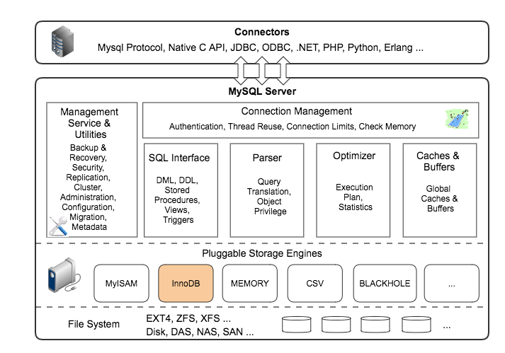

# MySQL

# 1.MySQL体系结构
### 数据库产品的架构一般可以分为应用层、逻辑层、物理层

## 1.1 Connectors
### MySQL首先是一个网络程序，其在TCP之上定义了自己的应用层协议。所以要使用MySQL，我们可以编写代码，跟MySQL Server建立TCP连接，之后按照其定义好的协议进行交互。当然这样比较麻烦，比较方便的办法是调用SDK，比如Native C API、JDBC、PHP等各语言MySQL Connector，或者通过ODBC。但通过SDK来访问MySQL，本质上还是在TCP连接上通过MySQL协议跟MySQL进行交互。

## 1.2 应用层
## 1.2.1 Connection Management
### 每一个基于TCP的网络服务都需要管理客户端链接，MySQL也不例外。MySQL会为每一个连接绑定一个线程，之后这个连接上的所有查询都在这个线程中执行。为了避免频繁创建和销毁线程带来开销，MySQL通常会缓存线程或者使用线程池，从而避免频繁的创建和销毁线程。客户端连接到MySQL后，在使用MySQL的功能之前，需要进行认证，认证基于用户名、主机名、密码。如果用了SSL或者TLS的方式进行连接，还会进行证书认证。

## 1.3 逻辑层
## 1.3.1 SQL Interface
### MySQL支持DML（数据操作语言）、DDL（数据定义语言）、存储过程、视图、触发器、自定义函数等多种SQL语言接口。

## 1.3.2 Parser
### MySQL会解析SQL查询，并为其创建语法树，并根据数据字典丰富查询语法树，会验证该客户端是否具有执行该查询的权限。创建好语法树后，MySQL还会对SQl查询进行语法上的优化，进行查询重写。

## 1.3.3 Optimizer
### 语法解析和查询重写之后，MySQL会根据语法树和数据的统计信息对SQL进行优化，包括决定表的读取顺序、选择合适的索引等，最终生成SQL的具体执行步骤。这些具体的执行步骤里真正的数据操作都是通过预先定义好的存储引擎API来进行的，与具体的存储引擎实现无关。

## 1.3.4 Caches & Buffers
### MySQL内部维持着一些Cache和Buffer，比如Query Cache用来缓存一条Select语句的执行结果，如果能够在其中找到对应的查询结果，那么就不必再进行查询解析、优化和执行的整个过程了。

## 1.4 物理层
## 1.4.1 Pluggable Storage Engine
### 存储引擎的具体实现，这些存储引擎都实现了MySQl定义好的存储引擎API的部分或者全部。MySQL可以动态安装或移除存储引擎，可以有多种存储引擎同时存在，可以为每个Table设置不同的存储引擎。存储引擎负责在文件系统之上，管理表的数据、索引的实际内容，同时也会管理运行时的Cache、Buffer、事务、Log等数据和功能。

## 1.4.2 File System
### 所有的数据，数据库、表的定义，表的每一行的内容，索引，都是存在文件系统上，以文件的方式存在的。当然有些存储引擎比如InnoDB，也支持不使用文件系统直接管理裸设备，但现代文件系统的实现使得这样做没有必要了。在文件系统之下，可以使用本地磁盘，可以使用DAS、NAS、SAN等各种存储系统。

